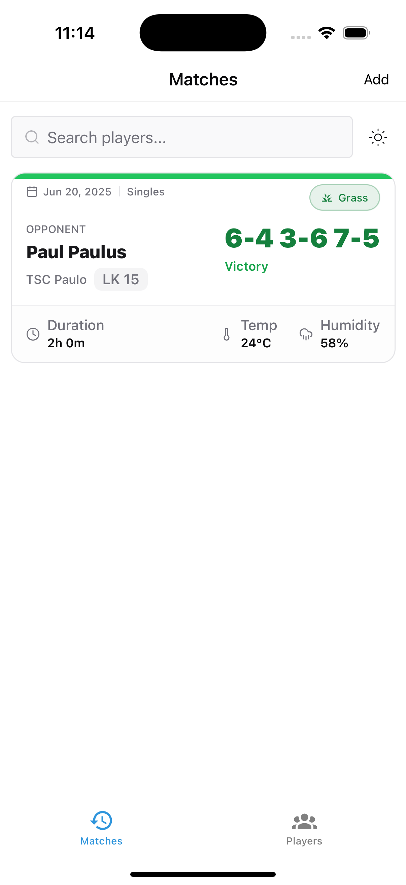

# Courtside



An Expo project by [Luca1905](https://github.com/Luca1905).

## Overview

**Courtside** is a Expo, React-Native application. I've build it, because I always wanted a match tracker for playing tennis. Recently the official match history site of the german tennis association was put behind a pay-wall, so I got to work. 

About the tech stack:
- Frontend: React Native / Expo
    - Styling: NativeWind
    - Components: React Native Reusables
    - Router: Expo router
- Backend: Convex
- Auth: Anonymous auth by Convex Auth
- Hosting Service: EAS by expo for building and deploying

## Features
- Add matches manually using the interactive scoreboard
- Select match venue using interactive map
- Adding new players / opponents
- Custom user profile
- Overview of your match history, including score, weather, venue etc.
- Overview of players, shared
- Small addons: Quick Actions (long press app icon in homescreen)

## Getting Started

### Prerequisites

- [Bun](https://bun.com/)
- [Xcode](https://developer.apple.com/xcode/)

### Installation

1. Clone the repository:
   ```bash
   git clone https://github.com/Luca1905/courtside.git
   cd courtside
   ```
2. Install dependencies:
   ```bash
   bun install
   ```
3. Set up backend:
   ```bash
   bun backend:dev
   ```
4. Configure your environment: [Follow this guide by expo](https://docs.expo.dev/get-started/set-up-your-environment/?mode=development-build&platform=ios&device=simulated)
5. Build using eas:
   ```bash
   eas build --platform ios --profile development
   ```
7. or locally (ios simulator):
   ```bash
   bun run ios
   ```
   Running on device:
   ```bash
   bun run ios:device
   ```

<div align="center">
  <a href="https://shipwrecked.hackclub.com/?t=ghrm" target="_blank">
    
  </a>
</div>
